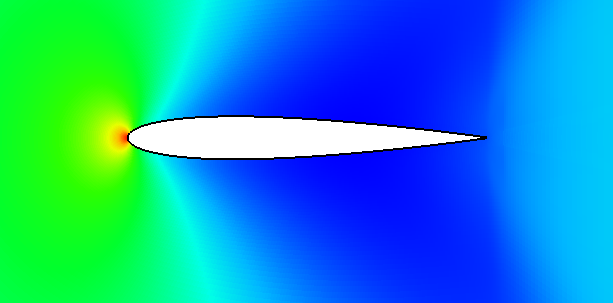
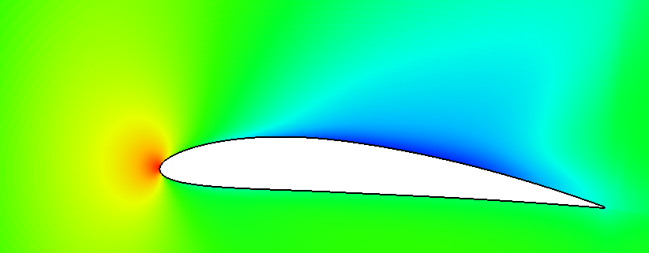

# FiniteVolume

<div align="center">
  
  <br>
  
</div>

A C++ standalone 2D unstructured finite-volume solver, with no external library
dependencies. Solves scalar diffusion, advection-diffusion of a passive
scalar, the compressible Euler equations, the compressible (laminar)
Navier-Stokes equations, or the Navier-Stokes equations closed with a
Spalart-Allmaras or k-omega SST RANS turbulence model, on an arbitrary
polygon mesh (cells may have any number of faces), driven by a plain-text
case file, and writes results as legacy VTK files.

## Build

Requires CMake >= 3.20 and a C++17 compiler with OpenMP support.

```
cmake -S . -B build -G "Ninja Multi-Config"
cmake --build build --config Release
```

Produces `build/bin/FiniteVolume.exe`.

## Run

```
FiniteVolume.exe <case_file>                     # run a simulation
FiniteVolume.exe --version                       # print build/version info
FiniteVolume.exe --validate-mesh <mesh_file>     # sanity-check a mesh file
```

## Documentation

- **[docs/MANUAL.md](docs/MANUAL.md)** — the full manual: architecture, case
  file reference, mesh formats, solvers (including how discontinuities/
  shocks are handled), output format, checkpointing, and known limitations.
- **[docs/fvmesh-format.md](docs/fvmesh-format.md)** — grammar spec for this
  project's own `.fvmesh` mesh format.
- **[CLAUDE.md](CLAUDE.md)** — quick-reference guide for coding agents
  working in this repo.

## License

GPL-3.0 — see [LICENSE](LICENSE).
